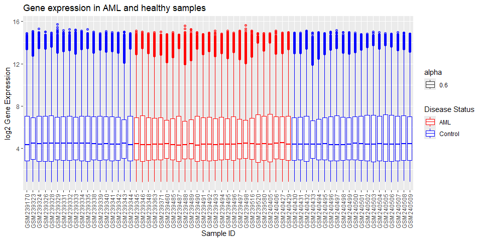
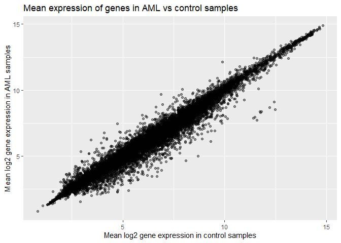
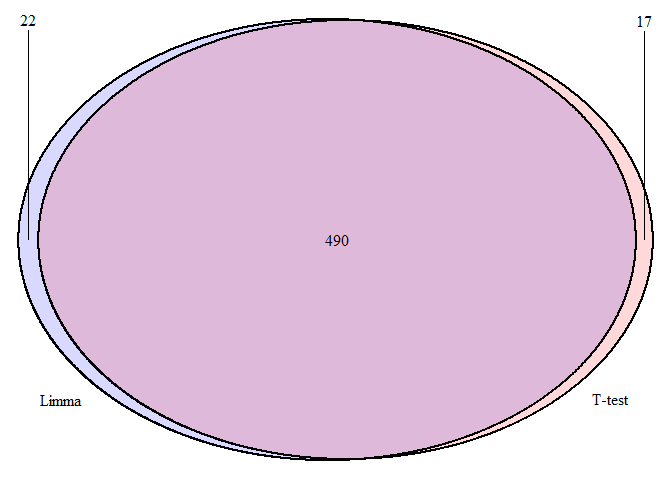

Differential expression in acute myeloid leukaemia (GSE9476): t-test vs
limma
================
Eden Black

This analysis identifies genes differentially expressed between acute
myeloid leukaemia (AML) and healthy bone marrow / peripheral blood in
the public microarray dataset GSE9476, and compares two ways of calling
them — a per-gene t-test and the `limma` linear-model framework.
Expression values are log2-transformed.

## Data import

``` r
library(tidyverse)

# Read in datasets
AML_data = read.csv('data/GSE9476_series_matrix.txt',
                    header = TRUE,
                    sep = '\t',
                    fill = TRUE,
                    comment.char = '!')

AML_metadata = read.csv('data/GSE9476_meta_info.txt',
                        header = TRUE,
                        sep = '\t',
                        fill = TRUE)

# Convert metadata sample IDs and disease status to factors for later analysis
AML_metadata$SampleID = as.factor(AML_metadata$SampleID)
AML_metadata$Disease_status = as.factor(AML_metadata$Disease_status)
```

## Dataset overview

Sample numbers per group are counted from the metadata (possible because
`Disease_status` is a factor), and each probeset is one row of the
expression table.

``` r
disease_status_counts = AML_metadata %>%
  group_by(Disease_status) %>%
  summarise(disease_status_count = n())

print(disease_status_counts)
```

    ## # A tibble: 2 × 2
    ##   Disease_status disease_status_count
    ##   <fct>                         <int>
    ## 1 AML                              26
    ## 2 Control                          38

``` r
probeset_number = nrow(AML_data)

paste('There are', probeset_number, 'probesets in the dataset')
```

    ## [1] "There are 22283 probesets in the dataset"

## Age as a covariate

Before comparing expression, I checked whether the two groups are
balanced on age, since an imbalance would be a potential confounder.

``` r
t.test(Age ~ Disease_status, data = AML_metadata)
```

    ## 
    ##  Welch Two Sample t-test
    ## 
    ## data:  Age by Disease_status
    ## t = 6.2687, df = 47.986, p-value = 9.743e-08
    ## alternative hypothesis: true difference in means between group AML and group Control is not equal to 0
    ## 95 percent confidence interval:
    ##  15.47480 30.08931
    ## sample estimates:
    ##     mean in group AML mean in group Control 
    ##              56.11538              33.33333

The groups differ significantly in age (p \< 0.05), so age is a
confounder to keep in mind when interpreting these results.

## Exploratory analysis

The expression table is checked for missing values, pivoted to long
format, and joined to disease status so that each measurement is
labelled AML or Control.

``` r
sum(is.na(AML_data))
```

    ## [1] 0

``` r
colSums(is.na(AML_metadata))
```

    ##       SampleID           Desc Disease_status            Age 
    ##              0              0              0             14

The metadata is missing age information for 14/64 samples; age will
therefore not be used as a confounder in statistical testing. This
introduces the possibility of DEGs reflecting age rather than disease
state, which must be kept in mind during interpretation.

``` r
# Tidy gene expression data by pivoting it into long format
AML_data_long = pivot_longer(
  data = AML_data,
  cols = GSM239170:GSM240509, # Exclude probe ID
  names_to = 'SampleID', # Match col name in metadata for easier joining
  values_to = 'Expression'
)

# Convert to factors for later analysis
AML_data_long$ID_REF = as.factor(AML_data_long$ID_REF)
AML_data_long$SampleID = as.factor(AML_data_long$SampleID)

str(AML_data_long)
```

    ## tibble [1,426,112 × 3] (S3: tbl_df/tbl/data.frame)
    ##  $ ID_REF    : Factor w/ 22283 levels "1007_s_at","1053_at",..: 1 1 1 1 1 1 1 1 1 1 ...
    ##  $ SampleID  : Factor w/ 64 levels "GSM239170","GSM239323",..: 1 2 3 4 5 6 7 8 9 10 ...
    ##  $ Expression: num [1:1426112] 3.02 3.29 2.93 2.92 3.16 ...

``` r
# Trim metadata to only SampleID (for join) and disease status
metadata_for_join = AML_metadata %>%
  select(SampleID, Disease_status)

# Join disease status from metadata to tidy gene expression data
AML_data_with_status = AML_data_long %>%
  left_join(metadata_for_join, by = 'SampleID')

str(AML_data_with_status)
```

    ## tibble [1,426,112 × 4] (S3: tbl_df/tbl/data.frame)
    ##  $ ID_REF        : Factor w/ 22283 levels "1007_s_at","1053_at",..: 1 1 1 1 1 1 1 1 1 1 ...
    ##  $ SampleID      : Factor w/ 64 levels "GSM239170","GSM239323",..: 1 2 3 4 5 6 7 8 9 10 ...
    ##  $ Expression    : num [1:1426112] 3.02 3.29 2.93 2.92 3.16 ...
    ##  $ Disease_status: Factor w/ 2 levels "AML","Control": 2 2 2 2 2 2 2 2 2 2 ...

``` r
sum(is.na(AML_data_with_status))
```

    ## [1] 0

A per-sample boxplot of expression, coloured by disease status, gives a
quick view of overall distribution and any obvious outlier samples.

``` r
ggplot(data = AML_data_with_status, aes(SampleID, Expression)) +
  geom_boxplot(aes(color = Disease_status, alpha = 0.6)) +
  scale_color_manual(values = c('AML' = 'red', 'Control' = 'blue')) +
  labs(title = 'Gene expression in AML and healthy samples',
       y = 'log2 Gene Expression',
       x = 'Sample ID',
       color = 'Disease Status') +
  guides(alpha = 'none') +
  scale_x_discrete(guide = guide_axis(angle = 90)) # Align x axis labels
```

<!-- -->

## Per-gene summary statistics

For each probeset, summary statistics (mean, SD, min, max) are computed
within each group, then joined and used to derive a log2 fold change
(mean AML − mean Control).

``` r
# Summarise AML data
AML_data_summary_stats = AML_data_with_status %>%
  filter(Disease_status == 'AML') %>%
  group_by(ID_REF) %>%
  summarise(mean_AML = mean(Expression),
            sd_AML = sd(Expression),
            min_AML = min(Expression),
            max_AML = max(Expression))

head(AML_data_summary_stats)
```

<div class="kable-table">

| ID_REF    | mean_AML |    sd_AML |  min_AML |  max_AML |
|:----------|---------:|----------:|---------:|---------:|
| 1007_s_at | 3.190831 | 0.2868866 | 2.738628 | 4.189943 |
| 1053_at   | 6.497534 | 0.4371053 | 5.707238 | 7.603169 |
| 117_at    | 5.352038 | 1.5432930 | 3.961892 | 9.644181 |
| 121_at    | 7.449728 | 0.3501351 | 6.665644 | 8.221074 |
| 1255_g_at | 2.265448 | 0.0755911 | 2.068680 | 2.398069 |
| 1294_at   | 7.870432 | 0.6348197 | 6.757480 | 9.531410 |

</div>

``` r
# Summarise control data
control_data_summary_stats = AML_data_with_status %>%
  filter(Disease_status == 'Control') %>%
  group_by(ID_REF) %>%
  summarise(mean_Control = mean(Expression),
            sd_Control = sd(Expression),
            min_Control = min(Expression),
            max_Control = max(Expression))

head(control_data_summary_stats)
```

<div class="kable-table">

| ID_REF    | mean_Control | sd_Control | min_Control | max_Control |
|:----------|-------------:|-----------:|------------:|------------:|
| 1007_s_at |     3.109452 |  0.1326354 |    2.843774 |    3.448303 |
| 1053_at   |     6.671247 |  0.5492746 |    5.932385 |    8.143075 |
| 117_at    |     6.475112 |  2.6338408 |    3.923634 |   12.358038 |
| 121_at    |     7.176393 |  0.2619885 |    6.771577 |    8.019825 |
| 1255_g_at |     2.239653 |  0.0717325 |    2.099221 |    2.512393 |
| 1294_at   |     7.715736 |  0.5259957 |    6.706907 |    8.929810 |

</div>

``` r
# Join tables to create full summary stats for each gene
full_data_summary_stats = AML_data_summary_stats %>%
  full_join(control_data_summary_stats, by = 'ID_REF')

# Add column for fold change (mean_AML - mean_control)
full_data_summary_stats = full_data_summary_stats %>%
  mutate(Fold_change = mean_AML - mean_Control)

str(full_data_summary_stats)
```

    ## tibble [22,283 × 10] (S3: tbl_df/tbl/data.frame)
    ##  $ ID_REF      : Factor w/ 22283 levels "1007_s_at","1053_at",..: 1 2 3 4 5 6 7 8 9 10 ...
    ##  $ mean_AML    : num [1:22283] 3.19 6.5 5.35 7.45 2.27 ...
    ##  $ sd_AML      : num [1:22283] 0.2869 0.4371 1.5433 0.3501 0.0756 ...
    ##  $ min_AML     : num [1:22283] 2.74 5.71 3.96 6.67 2.07 ...
    ##  $ max_AML     : num [1:22283] 4.19 7.6 9.64 8.22 2.4 ...
    ##  $ mean_Control: num [1:22283] 3.11 6.67 6.48 7.18 2.24 ...
    ##  $ sd_Control  : num [1:22283] 0.1326 0.5493 2.6338 0.262 0.0717 ...
    ##  $ min_Control : num [1:22283] 2.84 5.93 3.92 6.77 2.1 ...
    ##  $ max_Control : num [1:22283] 3.45 8.14 12.36 8.02 2.51 ...
    ##  $ Fold_change : num [1:22283] 0.0814 -0.1737 -1.1231 0.2733 0.0258 ...

``` r
sum(is.na(full_data_summary_stats))
```

    ## [1] 0

A scatterplot of mean AML vs mean Control expression shows the
relationship is highly linear — most genes sit on the y = x line. The
genes that stray from it are the candidates of interest.

``` r
# Create scatter plot
ggplot(full_data_summary_stats, aes(mean_Control, mean_AML)) +
  geom_point(alpha = 0.4) +
  labs(title = 'Mean expression of genes in AML vs control samples',
       x = 'Mean log2 gene expression in control samples',
       y = 'Mean log2 gene expression in AML samples')
```

<!-- -->

``` r
# T-test for difference in overall mean gene expression in AML vs control
t.test(full_data_summary_stats$mean_AML,
       full_data_summary_stats$mean_Control)
```

    ## 
    ##  Welch Two Sample t-test
    ## 
    ## data:  full_data_summary_stats$mean_AML and full_data_summary_stats$mean_Control
    ## t = -0.74899, df = 44560, p-value = 0.4539
    ## alternative hypothesis: true difference in means is not equal to 0
    ## 95 percent confidence interval:
    ##  -0.06479628  0.02896624
    ## sample estimates:
    ## mean of x mean of y 
    ##  5.091984  5.109899

As expected, overall gene expression is not shifted up or down between
groups. The signal is in individual genes, not the global mean.

## Differential expression: per-gene t-tests

A t-test of expression by disease status is run for every probeset, and
the t-score and p-value are joined onto the summary-statistics table.

``` r
t_test_table = AML_data_with_status %>%
  group_by(ID_REF) %>%
  mutate(t_score = t.test(Expression ~ Disease_status)$statistic, # Extract t-score into column
         p_value = t.test(Expression ~ Disease_status)$p.value) # Extract p-value into column
```

``` r
full_data_with_t_test = t_test_table %>%
  select(ID_REF, t_score, p_value) %>%
  group_by(ID_REF) %>%
  full_join(full_data_summary_stats, by = 'ID_REF') %>%
  unique() %>% # Remove duplicate rows
  ungroup %>% # Remove grouping to avoid problems later
  mutate(p_adj = p.adjust(p_value, method = 'BH'))

str(full_data_with_t_test)
```

    ## tibble [22,283 × 13] (S3: tbl_df/tbl/data.frame)
    ##  $ ID_REF      : Factor w/ 22283 levels "1007_s_at","1053_at",..: 1 2 3 4 5 6 7 8 9 10 ...
    ##  $ t_score     : Named num [1:22283] 1.35 -1.4 -2.14 3.38 1.37 ...
    ##   ..- attr(*, "names")= chr [1:22283] "t" "t" "t" "t" ...
    ##  $ p_value     : num [1:22283] 0.18607 0.16515 0.03597 0.00152 0.17697 ...
    ##  $ mean_AML    : num [1:22283] 3.19 6.5 5.35 7.45 2.27 ...
    ##  $ sd_AML      : num [1:22283] 0.2869 0.4371 1.5433 0.3501 0.0756 ...
    ##  $ min_AML     : num [1:22283] 2.74 5.71 3.96 6.67 2.07 ...
    ##  $ max_AML     : num [1:22283] 4.19 7.6 9.64 8.22 2.4 ...
    ##  $ mean_Control: num [1:22283] 3.11 6.67 6.48 7.18 2.24 ...
    ##  $ sd_Control  : num [1:22283] 0.1326 0.5493 2.6338 0.262 0.0717 ...
    ##  $ min_Control : num [1:22283] 2.84 5.93 3.92 6.77 2.1 ...
    ##  $ max_Control : num [1:22283] 3.45 8.14 12.36 8.02 2.51 ...
    ##  $ Fold_change : num [1:22283] 0.0814 -0.1737 -1.1231 0.2733 0.0258 ...
    ##  $ p_adj       : num [1:22283] 0.3544 0.3346 0.1586 0.0231 0.3456 ...

``` r
sum(is.na(full_data_with_t_test))
```

    ## [1] 0

Before calling DEGs, probesets are restricted to those reliably
expressed and not saturated. Requiring mean expression above 3 in both
groups leaves:

``` r
filter_a = nrow(full_data_with_t_test %>%
                  filter(mean_AML > 3 & mean_Control > 3))

paste('There are', filter_a, 'probesets remaining after filter a')
```

    ## [1] "There are 16026 probesets remaining after filter a"

Requiring maximum expression below 14 in at least one group leaves:

``` r
filter_b = nrow(full_data_with_t_test %>%
                  filter(max_AML < 14 | max_Control < 14))

paste('There are', filter_b, 'probesets remaining after filter b')
```

    ## [1] "There are 22171 probesets remaining after filter b"

Applying both criteria together leaves:

``` r
filter_c = nrow(full_data_with_t_test %>%
                  filter((mean_AML > 3 & mean_Control > 3) &
                           (max_AML < 14 | max_Control < 14)))

paste('There are', filter_c, 'probesets remaining after filter c')
```

    ## [1] "There are 15914 probesets remaining after filter c"

The combined expression filter is applied, then DEGs are called as
probesets with p_adj \< 0.05 and \|log2 fold change\| \> 1.

``` r
DEG_data_filter_c = full_data_with_t_test %>%
  filter((mean_AML > 3 & mean_Control > 3) &
           (max_AML < 14 | max_Control < 14))

dim(DEG_data_filter_c)
```

    ## [1] 15914    13

``` r
DEG_data_filtered = DEG_data_filter_c %>%
  filter(p_adj < 0.05 & abs(Fold_change) > 1)

str(DEG_data_filtered)
```

    ## tibble [507 × 13] (S3: tbl_df/tbl/data.frame)
    ##  $ ID_REF      : Factor w/ 22283 levels "1007_s_at","1053_at",..: 130 189 193 194 264 294 344 463 493 511 ...
    ##  $ t_score     : Named num [1:507] -4.97 5.23 -3.28 -3.25 8.76 ...
    ##   ..- attr(*, "names")= chr [1:507] "t" "t" "t" "t" ...
    ##  $ p_value     : num [1:507] 3.00e-05 4.26e-06 2.73e-03 1.88e-03 1.09e-11 ...
    ##  $ mean_AML    : num [1:507] 4.92 9.94 6.7 8.08 11.58 ...
    ##  $ sd_AML      : num [1:507] 2.17 0.836 2.416 1.111 0.486 ...
    ##  $ min_AML     : num [1:507] 2.91 7.67 2.94 6.4 10.72 ...
    ##  $ max_AML     : num [1:507] 8.71 11.38 10.92 11.33 12.41 ...
    ##  $ mean_Control: num [1:507] 7.1 8.91 8.31 9.11 10.54 ...
    ##  $ sd_Control  : num [1:507] 0.633 0.654 0.809 1.437 0.44 ...
    ##  $ min_Control : num [1:507] 5.4 7.3 6.88 7.79 9.42 ...
    ##  $ max_Control : num [1:507] 8.28 9.92 9.77 13.32 11.23 ...
    ##  $ Fold_change : num [1:507] -2.18 1.02 -1.61 -1.04 1.04 ...
    ##  $ p_adj       : num [1:507] 1.77e-03 4.60e-04 3.37e-02 2.66e-02 1.36e-07 ...

``` r
sum(is.na(DEG_data_filtered))
```

    ## [1] 0

``` r
paste('There are',
      nrow(DEG_data_filtered),
      'differentially expressed genes in the dataset')
```

    ## [1] "There are 507 differentially expressed genes in the dataset"

Splitting the DEGs by the sign of the fold change gives the up- and
down-regulated counts.

``` r
upregulated_DEGs = DEG_data_filtered %>%
  filter(Fold_change > 0)

# Number upregulated
paste('There are',
      nrow(upregulated_DEGs),
      'upregulated DEGs in the dataset')
```

    ## [1] "There are 102 upregulated DEGs in the dataset"

``` r
downregulated_DEGs = DEG_data_filtered %>%
  filter(Fold_change < 0)

# Number downregulated
paste('There are',
      nrow(downregulated_DEGs),
      'downregulated DEGs in the dataset')
```

    ## [1] "There are 405 downregulated DEGs in the dataset"

The ten most up- and down-regulated DEGs by fold change:

``` r
# 10 most upregulated DEGs with p-value, log2FC, and mean values
top_10_upregulated_DEGs = DEG_data_filtered %>%
  slice_max(order_by = Fold_change, n = 10) %>%
  select(ID_REF, p_value, Fold_change, mean_Control, mean_AML)

top_10_upregulated_DEGs
```

<div class="kable-table">

| ID_REF      |   p_value | Fold_change | mean_Control |  mean_AML |
|:------------|----------:|------------:|-------------:|----------:|
| 215489_x_at | 0.0000000 |    2.806378 |     3.431159 |  6.237537 |
| 206674_at   | 0.0000000 |    2.793421 |     6.876417 |  9.669838 |
| 210365_at   | 0.0000000 |    2.704195 |     4.736884 |  7.441080 |
| 204647_at   | 0.0000008 |    2.667401 |     4.096730 |  6.764131 |
| 206067_s_at | 0.0000014 |    2.337609 |     4.054346 |  6.391956 |
| 201105_at   | 0.0000000 |    2.236181 |     9.891301 | 12.127482 |
| 205131_x_at | 0.0008269 |    2.150490 |     4.204067 |  6.354558 |
| 205382_s_at | 0.0008141 |    2.146922 |     7.931564 | 10.078486 |
| 211709_s_at | 0.0003427 |    2.107120 |     6.624619 |  8.731739 |
| 216268_s_at | 0.0000009 |    2.061418 |     3.929634 |  5.991053 |

</div>

``` r
# 10 most downregulated DEGs with p-value, log2FC, and mean values
top_10_downregulated_DEGs = DEG_data_filtered %>%
  slice_min(order_by = Fold_change, n = 10) %>%
  select(ID_REF, p_value, Fold_change, mean_Control, mean_AML)

top_10_downregulated_DEGs
```

<div class="kable-table">

| ID_REF      |  p_value | Fold_change | mean_Control | mean_AML |
|:------------|---------:|------------:|-------------:|---------:|
| 209116_x_at | 8.00e-07 |   -3.950883 |    12.489345 | 8.538463 |
| 217414_x_at | 2.52e-05 |   -3.837153 |    11.578075 | 7.740921 |
| 212224_at   | 0.00e+00 |   -3.699978 |     8.710812 | 5.010834 |
| 217232_x_at | 2.00e-07 |   -3.545056 |    12.213326 | 8.668270 |
| 209458_x_at | 2.63e-05 |   -3.535036 |    11.419415 | 7.884379 |
| 211699_x_at | 2.56e-05 |   -3.516957 |    11.479616 | 7.962659 |
| 204018_x_at | 2.81e-05 |   -3.458872 |    11.758847 | 8.299976 |
| 206207_at   | 2.40e-06 |   -3.452333 |     8.090973 | 4.638640 |
| 211745_x_at | 2.43e-05 |   -3.414876 |    11.802806 | 8.387930 |
| 214414_x_at | 5.95e-05 |   -3.356328 |    11.726737 | 8.370409 |

</div>

## Differential expression: limma

The same DEG definition is applied using `limma`. The expression matrix
is prepared (probeset IDs as row names), a design matrix is built from
disease status, and a linear model is fitted with the contrast AML −
Control. As 14 of the 64 patients had no age data available, age was not
included in the model as a confounder.

``` r
AML_data_limma = AML_data
rownames(AML_data_limma) = AML_data_limma$ID_REF # Apply ID_REF to row names
AML_data_limma$ID_REF = NULL # Remove old ID_REF column
```

``` r
library(limma)

# Create design matrix based on metadata
design = model.matrix(~ 0 + AML_metadata$Disease_status)
colnames(design) = levels(AML_metadata$Disease_status)
```

``` r
fit = limma::lmFit(AML_data_limma, design)

contrast.matrix = limma::makeContrasts(AML_vs_Control =
                                  AML - Control, levels = design)

fit2 = limma::contrasts.fit(fit, contrast.matrix)
fit2 = limma::eBayes(fit2)

limma_results = limma::topTable(fit2,
                   coef = 'AML_vs_Control',
                   adjust.method = 'BH',
                   sort.by = 'P',
                   n = Inf)

str(limma_results)
```

    ## 'data.frame':    22283 obs. of  6 variables:
    ##  $ logFC    : num  -3.7 -3.21 -1.38 1.82 1.04 ...
    ##  $ AveExpr  : num  7.21 5.37 7.59 4.46 10.96 ...
    ##  $ t        : num  -10 -9.71 -9.66 9.29 9 ...
    ##  $ P.Value  : num  1.20e-14 3.79e-14 4.56e-14 1.98e-13 6.31e-13 ...
    ##  $ adj.P.Val: num  2.67e-10 3.39e-10 3.39e-10 1.10e-09 2.81e-09 ...
    ##  $ B        : num  22.7 21.6 21.5 20.1 19 ...

``` r
sum(is.na(limma_results))
```

    ## [1] 0

The limma results are joined to the summary-statistics table and put
through the same filters as the t-test approach, for a like-for-like
comparison: mean \> 3 in both groups, max \< 14 in at least one group,
p_adj \< 0.05, and \|log2 fold change\| \> 1.

``` r
# Create ID_REF column in limma results to join on
limma_results$ID_REF = rownames(limma_results)

# Join limma_results with summary stat data for further filtering
full_data_with_limma = limma_results %>%
  select(ID_REF, logFC, P.Value, adj.P.Val) %>%
  group_by(ID_REF) %>%
  full_join(full_data_summary_stats, by = 'ID_REF') %>%
  unique() %>% # Remove duplicate rows
  ungroup # Remove grouping to avoid problems later

str(full_data_with_limma)
```

    ## tibble [22,283 × 13] (S3: tbl_df/tbl/data.frame)
    ##  $ ID_REF      : chr [1:22283] "212224_at" "202478_at" "209586_s_at" "219624_at" ...
    ##  $ logFC       : num [1:22283] -3.7 -3.21 -1.38 1.82 1.04 ...
    ##  $ P.Value     : num [1:22283] 1.20e-14 3.79e-14 4.56e-14 1.98e-13 6.31e-13 ...
    ##  $ adj.P.Val   : num [1:22283] 2.67e-10 3.39e-10 3.39e-10 1.10e-09 2.81e-09 ...
    ##  $ mean_AML    : num [1:22283] 5.01 3.47 6.77 5.54 11.58 ...
    ##  $ sd_AML      : num [1:22283] 1.981 1.766 0.697 1.175 0.486 ...
    ##  $ min_AML     : num [1:22283] 2.67 2.36 5.49 3.5 10.72 ...
    ##  $ max_AML     : num [1:22283] 8.75 8.16 8.24 7.69 12.41 ...
    ##  $ mean_Control: num [1:22283] 8.71 6.67 8.15 3.72 10.54 ...
    ##  $ sd_Control  : num [1:22283] 0.979 0.878 0.456 0.289 0.44 ...
    ##  $ min_Control : num [1:22283] 6.51 3.73 6.7 3.38 9.42 ...
    ##  $ max_Control : num [1:22283] 10.56 8.6 8.9 4.73 11.23 ...
    ##  $ Fold_change : num [1:22283] -3.7 -3.21 -1.38 1.82 1.04 ...

``` r
sum(is.na(full_data_with_limma))
```

    ## [1] 0

``` r
limma_results_filtered = full_data_with_limma %>%
  filter((mean_AML > 3 & mean_Control > 3) &
           (max_AML < 14 | max_Control < 14) &
              adj.P.Val < 0.05 & abs(logFC) > 1)

str(limma_results_filtered)
```

    ## tibble [512 × 13] (S3: tbl_df/tbl/data.frame)
    ##  $ ID_REF      : chr [1:512] "212224_at" "202478_at" "209586_s_at" "219624_at" ...
    ##  $ logFC       : num [1:512] -3.7 -3.21 -1.38 1.82 1.04 ...
    ##  $ P.Value     : num [1:512] 1.20e-14 3.79e-14 4.56e-14 1.98e-13 6.31e-13 ...
    ##  $ adj.P.Val   : num [1:512] 2.67e-10 3.39e-10 3.39e-10 1.10e-09 2.81e-09 ...
    ##  $ mean_AML    : num [1:512] 5.01 3.47 6.77 5.54 11.58 ...
    ##  $ sd_AML      : num [1:512] 1.981 1.766 0.697 1.175 0.486 ...
    ##  $ min_AML     : num [1:512] 2.67 2.36 5.49 3.5 10.72 ...
    ##  $ max_AML     : num [1:512] 8.75 8.16 8.24 7.69 12.41 ...
    ##  $ mean_Control: num [1:512] 8.71 6.67 8.15 3.72 10.54 ...
    ##  $ sd_Control  : num [1:512] 0.979 0.878 0.456 0.289 0.44 ...
    ##  $ min_Control : num [1:512] 6.51 3.73 6.7 3.38 9.42 ...
    ##  $ max_Control : num [1:512] 10.56 8.6 8.9 4.73 11.23 ...
    ##  $ Fold_change : num [1:512] -3.7 -3.21 -1.38 1.82 1.04 ...

``` r
sum(is.na(limma_results_filtered))
```

    ## [1] 0

``` r
paste('There are', nrow(limma_results_filtered), 'DEGs in the dataset')
```

    ## [1] "There are 512 DEGs in the dataset"

## Comparing the two methods

An inner join between the two DEG sets counts the genes identified by
both methods.

``` r
# Identify DEGs in both methods using inner join
DEGs_limma_and_t_test = DEG_data_filtered %>%
  inner_join(limma_results_filtered, by = 'ID_REF')

overlapped_gene_count = nrow(DEGs_limma_and_t_test)

paste('There are', overlapped_gene_count, 'overlapped genes')
```

    ## [1] "There are 490 overlapped genes"

The overlap is visualised as a Venn diagram.

``` r
library(VennDiagram)
```

    ## Loading required package: grid

    ## Loading required package: futile.logger

``` r
# Create Venn diagram
grid.newpage()
grid.draw(venn.diagram(x = list(t_test = DEG_data_filtered$ID_REF,
                                limma = limma_results_filtered$ID_REF),
                        category.names = c('T-test', 'Limma'),
                        fill = c(alpha('red',0.3),
                                  alpha('blue',0.3)),
                       filename = NULL,
                       disable.logging = TRUE))
```

    ## INFO [2026-07-08 10:01:06] $x
    ## INFO [2026-07-08 10:01:06] list(t_test = DEG_data_filtered$ID_REF, limma = limma_results_filtered$ID_REF)
    ## INFO [2026-07-08 10:01:06] 
    ## INFO [2026-07-08 10:01:06] $category.names
    ## INFO [2026-07-08 10:01:06] c("T-test", "Limma")
    ## INFO [2026-07-08 10:01:06] 
    ## INFO [2026-07-08 10:01:06] $fill
    ## INFO [2026-07-08 10:01:06] c(alpha("red", 0.3), alpha("blue", 0.3))
    ## INFO [2026-07-08 10:01:06] 
    ## INFO [2026-07-08 10:01:06] $filename
    ## INFO [2026-07-08 10:01:06] NULL
    ## INFO [2026-07-08 10:01:06] 
    ## INFO [2026-07-08 10:01:06] $disable.logging
    ## INFO [2026-07-08 10:01:06] [1] TRUE
    ## INFO [2026-07-08 10:01:06]

<!-- -->

The two methods agree on the large majority of DEGs, each identifying a
small number the other does not. Those method-exclusive genes can be
retrieved with anti-joins.

``` r
t_test_exclusive_DEGs = DEG_data_filtered %>%
  anti_join(limma_results_filtered, by = 'ID_REF')

print(t_test_exclusive_DEGs)
```

    ## # A tibble: 17 × 13
    ##    ID_REF      t_score p_value mean_AML sd_AML min_AML max_AML mean_Control
    ##    <fct>         <dbl>   <dbl>    <dbl>  <dbl>   <dbl>   <dbl>        <dbl>
    ##  1 202983_at     -2.94 0.00458     6.26  1.11     4.15    8.40         7.29
    ##  2 203907_s_at   -3.00 0.00389     5.79  1.07     4.14    8.62         6.85
    ##  3 204891_s_at   -2.95 0.00448     4.61  1.98     2.99    9.58         6.54
    ##  4 205837_s_at   -3.01 0.00442     3.81  0.375    3.19    4.61         4.86
    ##  5 205931_s_at   -3.09 0.00326     3.70  1.04     2.68    6.86         5.19
    ##  6 206222_at     -3.03 0.00428     4.81  0.439    4.32    6.21         6.16
    ##  7 206707_x_at   -2.95 0.00444     7.56  1.20     5.47    9.63         8.70
    ##  8 207008_at     -3.02 0.00439     4.29  0.717    3.48    6.63         6.17
    ##  9 209183_s_at   -2.94 0.00482     4.54  0.873    3.55    6.90         5.59
    ## 10 209791_at     -3.08 0.00344     4.02  0.653    3.28    6.11         5.14
    ## 11 211163_s_at   -3.03 0.00427     3.41  0.489    3.01    5.24         5.03
    ## 12 211806_s_at   -3.19 0.00272     5.39  0.460    4.38    6.26         6.51
    ## 13 216252_x_at   -2.97 0.00457     4.11  0.779    3.36    6.58         5.18
    ## 14 218614_at     -3.02 0.00379     6.62  0.973    4.23    8.05         7.76
    ## 15 219243_at     -2.96 0.00433     3.69  1.47     2.76    8.70         5.15
    ## 16 221563_at      3.02 0.00372     7.81  1.25     3.96    9.55         6.58
    ## 17 41469_at      -3.16 0.00305     3.22  0.288    2.87    4.25         4.29
    ## # ℹ 5 more variables: sd_Control <dbl>, min_Control <dbl>, max_Control <dbl>,
    ## #   Fold_change <dbl>, p_adj <dbl>

``` r
limma_exclusive_DEGs = limma_results_filtered %>%
  anti_join(DEG_data_filtered, by = 'ID_REF')

print(limma_exclusive_DEGs)
```

    ## # A tibble: 22 × 13
    ##    ID_REF   logFC P.Value adj.P.Val mean_AML sd_AML min_AML max_AML mean_Control
    ##    <chr>    <dbl>   <dbl>     <dbl>    <dbl>  <dbl>   <dbl>   <dbl>        <dbl>
    ##  1 201169_…  1.33 0.00131    0.0175     5.18   2.18    2.20    8.90         3.86
    ##  2 204160_… -1.04 0.00213    0.0245     5.07   1.72    2.08    8.27         6.10
    ##  3 210665_…  1.34 0.00214    0.0246     4.85   2.32    1.74    8.90         3.51
    ##  4 212671_… -1.69 0.00220    0.0250     7.26   2.94    2.40   12.8          8.95
    ##  5 218232_…  1.03 0.00248    0.0272     4.09   1.93    2.85    9.31         3.06
    ##  6 217838_… -1.06 0.00324    0.0324     7.03   1.64    3.13    9.44         8.09
    ##  7 200923_…  1.17 0.00329    0.0327     6.32   2.29    3.01    9.85         5.15
    ##  8 214575_…  2.15 0.00350    0.0339     8.11   3.23    3.31   12.6          5.96
    ##  9 208727_…  1.09 0.00356    0.0343     9.74   1.60    6.55   13.1          8.65
    ## 10 204646_… -1.24 0.00356    0.0343     6.76   2.16    2.92   10.7          8.00
    ## # ℹ 12 more rows
    ## # ℹ 4 more variables: sd_Control <dbl>, min_Control <dbl>, max_Control <dbl>,
    ## #   Fold_change <dbl>

## Session information

``` r
sessionInfo()
```

    ## R version 4.5.3 (2026-03-11 ucrt)
    ## Platform: x86_64-w64-mingw32/x64
    ## Running under: Windows 11 x64 (build 26200)
    ## 
    ## Matrix products: default
    ##   LAPACK version 3.12.1
    ## 
    ## locale:
    ## [1] LC_COLLATE=English_United Kingdom.utf8 
    ## [2] LC_CTYPE=English_United Kingdom.utf8   
    ## [3] LC_MONETARY=English_United Kingdom.utf8
    ## [4] LC_NUMERIC=C                           
    ## [5] LC_TIME=English_United Kingdom.utf8    
    ## 
    ## time zone: Europe/Budapest
    ## tzcode source: internal
    ## 
    ## attached base packages:
    ## [1] grid      stats     graphics  grDevices utils     datasets  methods  
    ## [8] base     
    ## 
    ## other attached packages:
    ##  [1] VennDiagram_1.8.2   futile.logger_1.4.9 limma_3.66.0       
    ##  [4] lubridate_1.9.5     forcats_1.0.1       stringr_1.6.0      
    ##  [7] dplyr_1.2.1         purrr_1.2.2         readr_2.2.0        
    ## [10] tidyr_1.3.2         tibble_3.3.1        ggplot2_4.0.3      
    ## [13] tidyverse_2.0.0    
    ## 
    ## loaded via a namespace (and not attached):
    ##  [1] gtable_0.3.6         compiler_4.5.3       tidyselect_1.2.1    
    ##  [4] scales_1.4.0         statmod_1.5.2        yaml_2.3.12         
    ##  [7] fastmap_1.2.0        R6_2.6.1             labeling_0.4.3      
    ## [10] generics_0.1.4       knitr_1.51           pillar_1.11.1       
    ## [13] RColorBrewer_1.1-3   tzdb_0.5.0           rlang_1.2.0         
    ## [16] utf8_1.2.6           stringi_1.8.7        xfun_0.58           
    ## [19] S7_0.2.2             otel_0.2.0           timechange_0.4.0    
    ## [22] cli_3.6.6            formatR_1.14         withr_3.0.3         
    ## [25] magrittr_2.0.5       futile.options_1.0.1 digest_0.6.39       
    ## [28] rstudioapi_0.19.0    hms_1.1.4            lifecycle_1.0.5     
    ## [31] vctrs_0.7.3          evaluate_1.0.5       glue_1.8.1          
    ## [34] lambda.r_1.2.4       farver_2.1.2         rmarkdown_2.31      
    ## [37] tools_4.5.3          pkgconfig_2.0.3      htmltools_0.5.9
